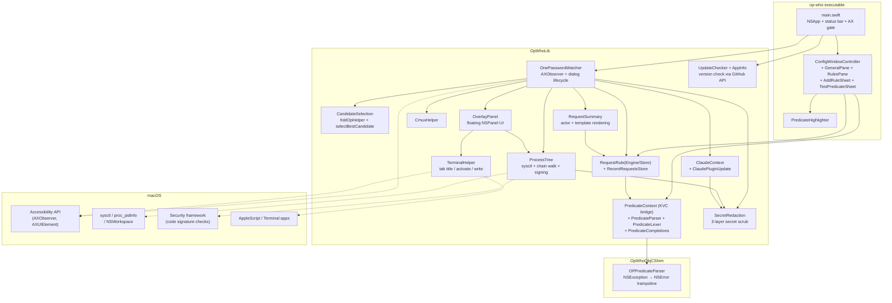
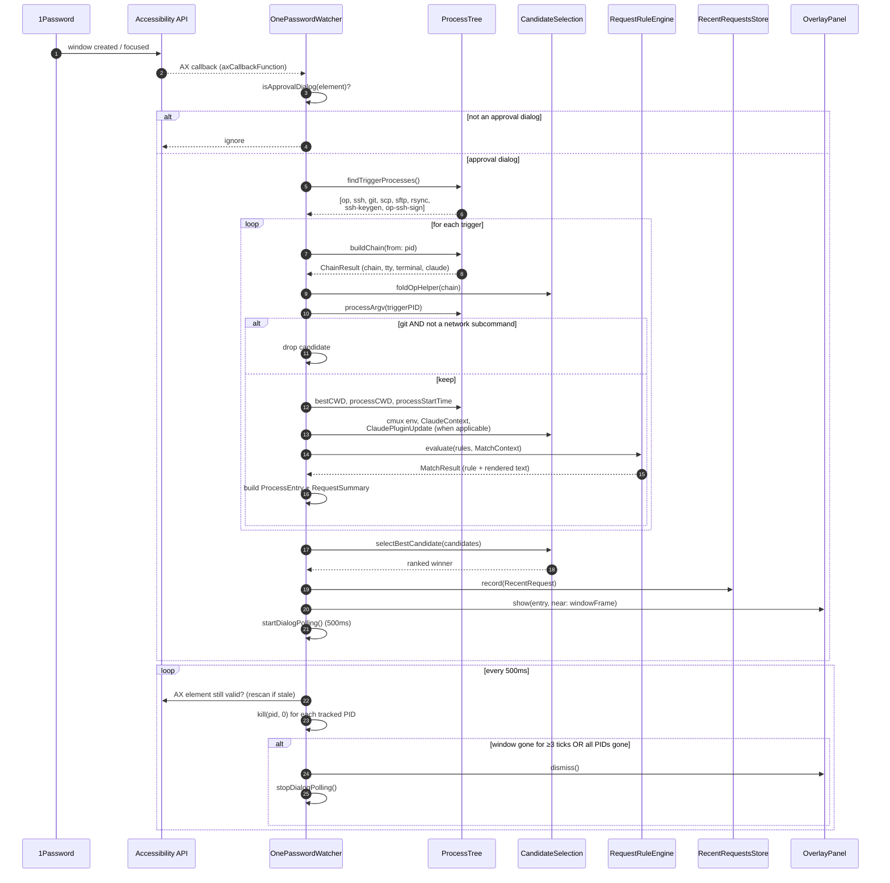
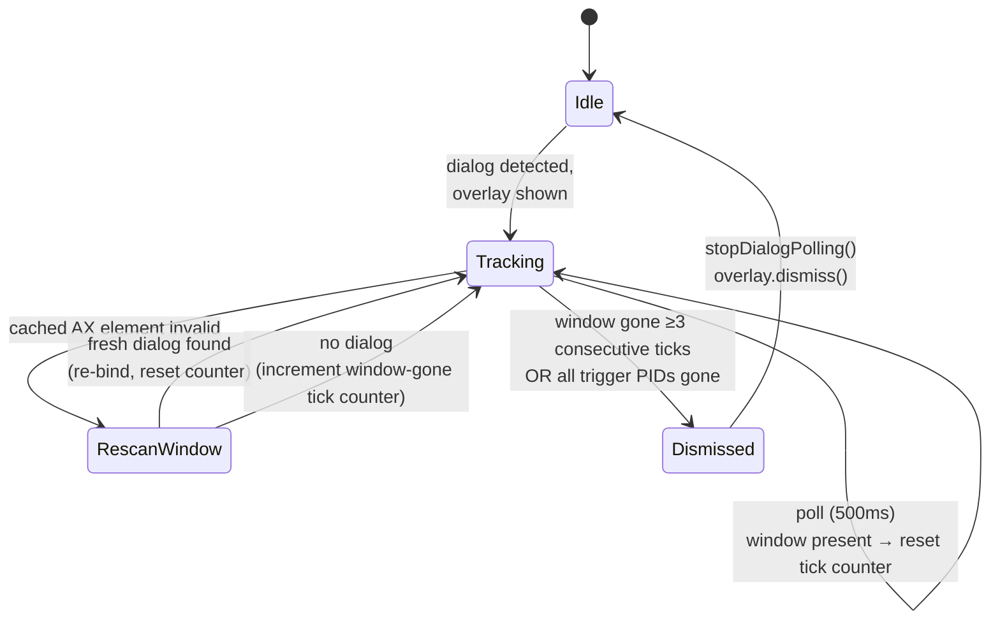
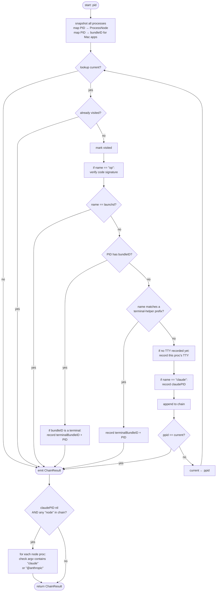

# op-who Architecture

## 1. Overview

`op-who` is a macOS menu bar utility that identifies which process triggered a 1Password approval dialog. When 1Password presents an approval prompt for the CLI (`op`) or the SSH agent integration, the dialog tells you *which application* requested access, but not *which terminal session* or *which command*. `op-who` fills in that gap by detecting the dialog, finding plausible trigger processes, walking each one's parent chain up to the terminal, running the captured context through a user-editable rule engine, and showing a floating overlay with the rendered description, process chain, working directory, terminal tab title, and (where applicable) Claude Code session and recent prompt.

The app runs as a menu bar item (`LSUIElement=true`), holds Accessibility permission to observe 1Password's window events, and is non-sandboxed because it must enumerate other processes and read their working directories. It is distributed as a signed and notarized `.app` bundle.

## 2. High-Level Architecture

`op-who` is a Swift Package with three targets: a small Objective-C shim (`OpWhoObjCShim`) that traps NSPredicate parse exceptions, a library (`OpWhoLib`) that contains all logic, and a thin executable (`op-who`) that wires up `NSApplication`, the status bar item, and the Settings window.

Module responsibilities at a glance:

- **`main.swift`** — bootstraps `NSApplication`, installs the status bar item and an Edit-menu-bearing main menu, requests Accessibility permission (with restart-on-grant polling), instantiates `RequestRuleStore`, `RecentRequestsStore`, and `OnePasswordWatcher`. Its status-bar menu also carries "About op-who", "Check for Updates…", "Settings…", and "Quit op-who".
- **`ConfigWindowController` + `RulesPane` + `GeneralPane` + `AddRuleSheetController` + `TestPredicateSheetController`** — Settings UI. Single scrollable pane with a unified user-+-built-in rules table, a detail form (name, predicate, template, kind, comment), the "Replaces actor" toggle, a live template preview, syntax-highlighted predicate editing, identifier/keyword autocomplete, and a sheet for replaying a draft predicate against the recent-requests ring buffer.
- **`OnePasswordWatcher`** — attaches an `AXObserver` to 1Password, classifies window events as approval dialogs, assembles candidate entries, runs the rule engine, records to the ring buffer, displays the chosen entry, and polls for dismissal.
- **`ProcessTree`** — pure logic for process enumeration, parent-chain walking, app-boundary detection, code signature verification, CWD lookup, argv/env reads, start-time reads, and Claude Code detection.
- **`CandidateSelection`** — `foldOpHelper` collapses the `op` biometric-helper child into its `op` parent, and `selectBestCandidate` ranks surviving candidates by kind then start time.
- **`RequestRule` / `RequestRuleEngine` / `RequestRuleStore`** — the rule engine. NSPredicate-driven, first-match-wins, with placeholder-empty-means-fall-through semantics. Ships with a built-in ruleset; users can add their own and disable any built-in.
- **`PredicateContext` / `PredicateParser` / `PredicateLexer` / `PredicateCompletions`** — KVC bridge that exposes a `MatchContext` to NSPredicate, the Swift-throwing facade over `OPPredicateParser`, and the syntactic support (token kinds, keywords, identifier list) the Settings editor uses for highlighting and autocomplete.
- **`RequestSummary`** — produces the actor prefix ("Claude Code session 'foo'", "iTerm tab 'work'", "Your zsh shell"), renders the matched rule's template, and assembles the final `(title, subtitle, kind, isWarning)` tuple shown in the overlay and persisted to the ring buffer.
- **`ClaudeContext` / `ClaudePluginUpdate`** — looks up the Claude session JSONL transcript to extract the last user prompt / Bash invocation, and detects Claude's background plugin/marketplace refresh `git` jobs by checking the trigger's CWD against `~/.claude/plugins/known_marketplaces.json`.
- **`CmuxHelper`** — reads cmux's session state file to translate a TTY into workspace/surface titles and the ⌘N / ⌃N keyboard shortcuts that jump to them.
- **`RecentRequestsStore`** — ring buffer (default capacity 20) persisted to `recent-requests.json`. Drives the Test Predicate sheet, the "Add from recent" rule template, and is greppable from the command line.
- **`OverlayPanel`** — non-activating floating `NSPanel` that renders the single chosen entry with chain, CWD, terminal/cmux info, Claude session + last prompt, and "Show Tab" / "Send Message" actions.
- **`TerminalHelper`** — terminal-app integration: tab title lookup, tab activation, TTY message writes, plus per-terminal keyboard-shortcut hints (e.g. "⌘1") for jumping to the source tab.
- **`UpdateChecker` / `AppInfo`** — `AppInfo` reads the running bundle's marketing version and holds the repo URL; `UpdateChecker` powers the "Check for Updates…" menu item by fetching GitHub's `/releases/latest`, comparing tags numerically, and reporting up-to-date / update-available / failed. Pure parse/compare/evaluate helpers are separated from the network call so they're unit-testable.
- **`SecretRedaction`** — pure functions that scrub secrets out of any captured text before it reaches the overlay, the unified log, the rule engine, or the ring buffer. `redactArgv` (count- and order-preserving) is applied to trigger argv at capture; `redactString` covers interpreter inline-command snippets and Claude Code context. Three layers run per token: `op`-field assignments, known token shapes, then a high-entropy catch-all (see §4.14).
- **`OPPredicateParser` (ObjC)** — wraps `+[NSPredicate predicateWithFormat:]` in `@try`/`@catch`. Swift can't catch Objective-C exceptions directly, so without this shim a typo in a user-authored predicate would crash the app at parse time.

## 3. Lifecycle: From Approval to Overlay

### 3.1 Sequence Diagram

The full path from a 1Password approval prompt to a dismissed overlay:

Two structural points worth noting up front:

- **The watcher displays a single entry, not a list.** Earlier versions deduplicated by TTY and rendered every survivor; the current implementation runs each trigger through `selectBestCandidate` and shows only the winner. *All* surviving PIDs are still tracked for dismissal so dialogs don't close prematurely when one sibling exits.
- **Rule evaluation happens once, at detection time.** The matched rule's id/name and rendered text are stored on the `ProcessEntry` and reused by the overlay, the ring buffer, and the debug log. No downstream consumer re-evaluates the rules.

### 3.2 Detection: CLI vs SSH-Agent Dialogs

1Password renders its UI in an Electron web view. When a window first appears, the AX tree is often empty or only partially populated, so any content-based detection ("does the dialog body say *Authorize*?") is racy and unreliable.

`OnePasswordWatcher.isApprovalDialog` therefore avoids inspecting dialog contents and delegates the decision to the pure static `isApprovalWindow(role:subrole:title:)`, which classifies *positively* on the window title:

1. **Subrole match** — `AXSubrole == "AXDialog"` is unambiguously an approval dialog (GUI approvals).
2. **Bare-title match** — a plain `AXWindow` is an approval prompt *only* when its title, trimmed of whitespace, equals the bare app name `"1Password"` (case-insensitive). Every persistent 1Password surface is named descriptively — `Quick Access — 1Password`, `<Account> — 1Password`, `Settings`, `Watchtower` — and only the CLI and SSH approval prompts carry the bare `1Password` title.

Matching the bare title positively (rather than denylisting named surfaces) is the deliberate design: a denylist could never be exhaustive across future or localized surfaces, so Quick Access, account windows, and anything else with a descriptive title are excluded by construction. This replaced an earlier exclusion-by-title-prefix denylist (see the 0.9.0 changelog).

A candidate window only produces an overlay if `ProcessTree.findTriggerProcesses()` finds at least one running process named `op`, `ssh`, `git`, `scp`, `sftp`, `rsync`, `ssh-keygen`, or `op-ssh-sign`. Without trigger processes there's nothing meaningful to show, and the overlay is suppressed.

This split has a consequence: there is no separate codepath for CLI vs SSH-agent approvals. Both result in the same trigger-process scan and the same overlay layout. Multiple trigger processes are collapsed to a single displayed entry by `selectBestCandidate`.

### 3.3 Dismissal

Dismissal is poll-based rather than event-based. 1Password does not consistently fire `kAXUIElementDestroyedNotification` for its dialogs (the Electron view re-renders asynchronously and can invalidate AX element references), so `OnePasswordWatcher` runs a 500 ms timer whose per-tick decision lives in the pure static `shouldDismiss(...)`. It combines two independent signals:

The two signals:

1. **Window signal (debounced).** Read `kAXRoleAttribute` on the cached `AXUIElement`. If the call fails, the cached reference is stale — re-enumerate 1Password's windows and re-bind to a fresh approval-dialog element if one still exists. A tick where the window is present (or the rescan re-binds one) resets a counter; a tick where it's gone increments it. The window signal only fires after **3 consecutive gone ticks** (`windowGoneTickThreshold`, ≈1.5 s), which rides out Electron's intermittent AX-element invalidations during re-renders.
2. **Process signal.** For every triggering PID recorded when the overlay was shown, send signal `0` via `kill(pid, 0)`. This delivers no signal but returns whether the process exists. When the tracked set is non-empty and *all* of it is gone, the trigger side of the dialog has resolved. This fires immediately (no debounce), which is what handles the case where op-who latched onto a 1Password window that never goes AX-gone — e.g. the main window.

**Dismissal fires when *either* signal fires** (`windowGoneSignal || procsGoneSignal`). The debounce on the window signal — rather than requiring the process signal to corroborate it — is what suppresses false dismissals from a dialog that flickers its AX element while still visible; the process signal independently catches the never-goes-AX-gone case. Tracking *all* surviving candidate PIDs (not just the displayed one) is what keeps the process signal from firing early when one SSH sibling exits while others (and the prompt) are still alive.

There's also a re-detection guard: 1Password fires multiple `AXWindowCreated`/`AXFocusedWindowChanged` events for a single logical approval (empty shell → re-render → real title). When `handleWindowEvent` fires for a PID already in `trackedProcessPIDs`, the watcher refreshes the cached AX element and skips the re-render — the overlay would otherwise appear to flash or relocate.

## 4. Components

### 4.1 `main.swift` — bootstrap and Accessibility gate

Wires up `NSApplication`, creates the menu-bar status item (a 1Password-style cutout glyph drawn programmatically — see `Self.menuBarIcon()`) with its drop-down menu (About op-who, Check for Updates…, Settings…, Quit op-who), and instantiates `RequestRuleStore`, `RecentRequestsStore`, and `OnePasswordWatcher`. "About" shows the running `AppInfo.version`; "Check for Updates…" runs `UpdateChecker` (see §4.13) and reports the result in an alert. Two non-obvious responsibilities:

- **Main menu for Edit shortcuts.** LSUIElement apps don't get a main menu by default, which means text fields in the Settings window never see Cmd-C/V/X/Z (those route through the menu's responder chain). `installMainMenu()` adds a minimal app menu plus an Edit menu so the Settings window's text fields support copy/paste/undo. The menu bar only appears while op-who is the active app — i.e. while Settings is in front — so it doesn't intrude in other apps.
- **Accessibility trust gate.** Calls `AXIsProcessTrustedWithOptions` with `kAXTrustedCheckOptionPrompt: true`. If permission is missing, shows a one-shot alert directing the user to System Settings and *starts a 2-second polling timer*. When trust flips on, the watcher's `AXObserver` would be permanently inert until restart (registration is gated by trust at the moment of registration), so the polling timer relaunches the bundle automatically via a detached `/bin/sh` helper. No manual reopen needed.

The `ruleStore.onRulesChanged` callback publishes the merged user-+-built-in list to `OpWhoConfig.rules` on every save, so the running watcher picks up rule edits without a restart.

### 4.2 `ConfigWindowController` and Settings UI

A single scrollable pane (the tabbed layout from earlier versions is gone). Hosts two sub-views:

- **`GeneralPane`** — the "Run on startup" toggle, wired to `SMAppService`.
- **`RulesPane`** — the unified rules table. Rows are the merged `userRules + visibleBuiltIns` list returned by `RequestRuleStore.allRules`, with user rules first. Each row has a checkbox that flips the rule's `enabled` flag (for user rules) or toggles its presence in `disabledBuiltInIDs` (for built-ins). The detail form below the table edits the selected rule's name, predicate, template, kind, comment, and the "Replaces actor" / "Warning" flags.

The predicate editor is an `NSTextView` with:

- **Syntax highlighting** — `PredicateHighlighter` (in the executable target) runs `PredicateLexer.tokenize` over the buffer and applies color to keywords, identifiers, string literals, and numbers.
- **Autocomplete** — Cmd-. / Esc invokes `PredicateCompletions.candidates(forPartialWord:)`, which returns the union of `PredicateContext.exposedKeys` and `PredicateLexer.keywords` filtered by case-insensitive prefix.
- **Deferred error display** — parse errors don't pop up while you're mid-type; they appear after a short debounce so the editor doesn't flash red on every keystroke.
- **Live template preview** — `previewTitle(rule:, recent:)` renders the rule's template against the most recent matching entry in the ring buffer and shows what the overlay text would look like, including the actor prefix. Useful for catching placeholder typos without waiting for a real 1Password prompt.

The window vends a custom field editor with `allowsUndo = true` so Cmd-Z works inside text fields (the default field editor has it off), and intercepts Cmd-W to close the window (LSUIElement apps don't get the Window menu's standard `performClose:` binding).

`AddRuleSheetController` is the sheet that pops up from the "+ from recent" affordance: it lists ring-buffer entries and pre-fills a draft rule with a sensible predicate built from the captured context (`triggerName`, `subcommand`, `triggerCwd BEGINSWITH` of the chain's CWD, non-flag argv tokens).

`TestPredicateSheetController` replays a draft predicate against every entry in the ring buffer and shows which ones it matches — the editor-side complement to the live preview, useful for getting selectivity right without flooding the overlay with false positives.

### 4.3 `OnePasswordWatcher` — dialog lifecycle

The longest-lived object in the app. Responsibilities:

- **Attach/detach lifecycle** — observes `NSWorkspace.didLaunchApplicationNotification` and `…didTerminateApplicationNotification` for the two known 1Password bundle IDs (`com.1password.1password`, `com.agilebits.onepassword7`). On attach, verifies the running 1Password's code signature against Apple Team ID `2BUA8C4S2C` *before* registering the AX observer — this prevents a maliciously-renamed process from receiving AX notifications.
- **AX observer registration** — creates an `AXObserver` for the 1Password PID, subscribes to `kAXWindowCreatedNotification` and `kAXFocusedWindowChangedNotification`, and adds the observer's run loop source to `CFRunLoopGetMain()` so callbacks fire on the main thread.
- **Approval-dialog classification** — `isApprovalDialog(_:)` (see §3.2).
- **Candidate assembly** — for each trigger process: walk the chain, fold the `op` biometric-helper child into its parent via `foldOpHelper`, look up argv via `processArgv` and scrub it with `redactArgv` (see §4.14), drop non-network `git` triggers, look up terminal tab info, extract Claude session/context, look up the trigger CWD and `bestCWD`, detect a Claude plugin update if it's a `git` trigger under `~/.claude/plugins/`, read cmux workspace/surface info when running under cmux, run the matcher engine, build a `ProcessEntry` carrying the matched rule's id/name/builtInID and the rendered summary.
- **Candidate ranking** — `selectBestCandidate` (see §4.4).
- **Ring buffer record** — every shown candidate (after ranking) is appended to the `RecentRequestsStore`.
- **Re-show suppression** — when `handleWindowEvent` fires for a PID already being polled, the watcher refreshes the cached AX element and skips the overlay re-render.
- **Polling** — see §3.3.

The AX C callback `axCallbackFunction` (file-private, outside the class) is the trampoline from the C-API observer back into Swift. It uses `Unmanaged.passUnretained` to round-trip a `self` pointer through the `refcon` parameter. Because it's `passUnretained`, the watcher must outlive its own observer — `deinit` removes notifications before the references drop.

Performance is measured inline via a small `measure(label, body)` helper that emits per-step timings to the unified log; the overall `handleWindowEvent` timing is also logged. There is no aggregate metrics emission — these are diagnostic logs intended for ad-hoc inspection.

### 4.4 `CandidateSelection` — folding and ranking

Two pure functions used by the watcher.

`foldOpHelper(chain:)` walks the chain dropping each leading `op` node that has another `op` node as its direct parent and is *not* itself signature-verified. The intuition: 1Password's CLI forks a biometric-helper child whose argv and signature verification are inaccessible to us; the user-visible command is the parent `op` process. Folding ensures the trigger we render is the one the user typed.

`selectBestCandidate(_:)` picks one winner among multiple triggers detected at the moment a dialog appeared. Ranking, most preferred first:

1. `.onePasswordCLI` (verified `op` binary)
2. `.ssh` (real network operation)
3. `.unknown` (unrecognized but valid candidate)
4. `.unverifiedOp` (last resort — usually a helper we failed to fold)

Within the same rank, the *oldest* (earliest start time) wins. 1Password queues approval requests in arrival order, so the oldest pending request is the one the dialog is for; newer processes are usually downstream consequences.

### 4.5 `ProcessTree` — process discovery and chain walking

A pure namespace (`enum`, no instances). All functions are static and side-effect-free, which makes the bulk of the testable surface live here.

Key responsibilities:

- **Enumeration** — `allProcesses()` calls `sysctl(KERN_PROC, KERN_PROC_ALL)`, sizes the kinfo buffer dynamically, and maps each `kinfo_proc` to a `ProcessNode` (PID, PPID, name, TTY device path, `executablePath: nil` initially, `isVerifiedOnePasswordCLI: false`).
- **Trigger discovery** — `findTriggerProcesses()` does a single scan and filters by name (`op`, `ssh`, `git`, `scp`, `sftp`, `rsync`, `ssh-keygen`, `op-ssh-sign`). Code signature verification of `op` is *not* done here — it's deferred to chain-building time so initial detection isn't slowed by a Security-framework call per match.
- **Chain walking** — `buildChain(from:)` is the workhorse (see §5).
- **Code signing** — two entry points:
  - `isRunningProcessSignedByOnePassword(pid:)` uses `SecCodeCopyGuestWithAttributes` (live process) and is used to gate AX-observer attachment to 1Password itself.
  - `isSignedByOnePassword(path:)` uses `SecStaticCodeCreateWithPath` (on-disk binary) and is used to badge `op` processes in the overlay (verified = green, unverified = orange).

  Both check the same requirement: `anchor apple generic and certificate leaf[subject.OU] = "2BUA8C4S2C"`.
- **Per-process reads via `proc_pidinfo`** — `processCWD(pid:)` (PROC_PIDVNODEPATHINFO), `processStartTime(pid:)` (PROC_PIDTBSDINFO, used for candidate ranking). Direct kernel queries are preferred over `lsof` because some terminal multiplexers cause `lsof` to return stale or wrong CWDs.
- **Per-process reads via `sysctl KERN_PROCARGS2`** — `processArgv(pid:)` returns the full argv (used by the rule engine and the git-network filter), and `processEnvironment(pid:, names:)` extracts the specific env vars cmux sets (`CMUX_WORKSPACE_ID`, `CMUX_TAB_ID`).
- **Claude Code detection** — Claude Code ships in two flavors: a Bun-based standalone binary (Homebrew install, process name `claude`) and a Node CLI (npm install, process name `node`). We support both. First check for a process literally named `claude` in the chain — this catches the Homebrew/Bun build. If none, fall back to scanning any `node` processes in the chain and asking `KERN_PROCARGS2` whether their argv contains `claude` or `@anthropic` — this catches the npm build. The session name is then resolved via `claudeSessionInfo(pid:)`, which reads the process CWD via `proc_pidinfo` and returns the basename. The Bun build does not keep session JSONL files open as long-lived file descriptors, so any approach based on scanning `lsof` output for `.claude/projects/` paths would miss them; the CWD basename is a stable proxy for both flavors.
- **Terminal helper match** — terminal apps like iTerm spawn helper processes (`iTermServer-…`) that aren't NSWorkspace apps but stand in for one. When chain-walking hits a process whose name matches one of `terminalHelperPrefixes`, we record the helper's bundle ID as the terminal and stop the walk — same as if we'd hit the GUI app directly.
- **Path tidying** — `tidyPath(_:)` replaces `$HOME` with `~` for display.

### 4.6 Rule engine: `RequestRule`, `RequestRuleEngine`, `RequestRuleStore`

`MatchContext` is the input to evaluation: the process chain, trigger argv, `cwd` and `triggerCwd`, `claudeSession`, optional `ClaudePluginUpdate`, and `terminalBundleID`. It's built once per detection by `OnePasswordWatcher` and passed straight to the engine.

`RequestRuleEngine.evaluate(rules:, context:)` walks the rule list in order. For each enabled rule, it parses the predicate (lazily, every evaluation) via `PredicateParser.parse`, evaluates it against `MatchContext.predicateBridge()` (a `PredicateContext` KVC object), and if true tries to render the template via `renderTemplate`. **A template that references a placeholder resolving to empty causes a non-match** — the engine falls through to the next rule. That's how the built-ins do "structured render, then raw fallback" pairs on the same predicate. Predicates that fail to parse are logged and skipped, never crashed on.

`RequestRule` carries the predicate, template, kind, `replacesActor` flag, warning flag, optional comment, enabled flag, and an optional `builtInID` (a stable, release-spanning string slug, frozen on first ship). The `id: UUID` is regenerated per process run for built-ins; the `builtInID` is what survives across restarts.

`RequestRuleStore` persists user rules and the set of disabled built-in IDs to `~/Library/Application Support/com.stigbakken.op-who/rules.json` (v2 schema). The store also handles migration from the v1 bare-array format. `allRules` returns the merged view: `userRules + visibleBuiltIns`, with disabled built-ins kept in the list (with `enabled = false`) so the Settings UI can render them as greyed-out rows. The engine itself skips any rule whose `enabled` is false.

The user-facing semantics of all this — actor vs template, placeholder list, NSPredicate cheatsheet, examples — live in [`docs/rules.md`](rules.md).

### 4.7 Predicate plumbing: `PredicateContext`, `PredicateParser`, `PredicateLexer`, `PredicateCompletions`

`PredicateContext` is an `@objc` NSObject whose properties are the exposed predicate keys (`triggerName`, `triggerArgv`, `subcommand`, `chainNames`, `cwd`, `triggerCwd`, `binaryVerified`, `claudeSession`, `terminalBundleID`, plus the `plugin*` fields). NSPredicate evaluates against arbitrary objects via KVC, so wrapping a `MatchContext` in this bridge gives the engine its view of the context. `PredicateContext.exposedKeys` is also the source of truth for autocomplete and the editor's known-keys validator.

`PredicateParser.parse(_:)` is the Swift-throwing facade. Two responsibilities:

- **Tilde expansion.** Quoted string literals starting with `~/` (or just `~`) are expanded to the user's home directory before parsing — `triggerCwd BEGINSWITH "~/git/foo"` is much nicer than the literal `/Users/stig/…` and travels between machines. Expansion is implemented as a small state machine that tracks quote nesting and backslash escapes so `"foo~bar"` and `"\""` don't fool it.
- **Exception trapping.** Calls into `OPPredicateParser` (the ObjC shim), which wraps `+[NSPredicate predicateWithFormat:]` in `@try`/`@catch` and surfaces the raised `NSException` as an `NSError`. Swift can't catch ObjC exceptions, so without this trampoline a typo in a user predicate would crash the app.

`PredicateLexer` produces a stream of typed tokens (keyword / identifier / string / number / punctuation / comment) for the highlighter and the keyword-aware completion engine. `PredicateCompletions.candidates(forPartialWord:)` is a thin filter over `exposedKeys ∪ keywords` that powers the predicate editor's autocomplete.

### 4.8 `RequestSummary` — actor + template rendering

Given a captured request, builds the user-visible `(title, subtitle, kind, isWarning)`:

- Runs the engine to pick the rule and render its template.
- Computes the **actor** prefix from chain / claude session / terminal / cmux info. Examples: `Claude Code in cmux workspace 'work'`, `iTerm tab 'build'`, `Your zsh shell`, `Process 12345`. Generic shell prompts and cmux's `Item-N` AX placeholders are filtered out so they don't surface as actor text.
- If the matched rule's `replacesActor` is true, the rendered template is the whole title; otherwise the title is `"<actor> <rendered>"`.
- Builds a `subtitle` that includes session, terminal, and CWD where not already named in the title.

`previewTitle(rule:, recent:)` is the same machinery exposed to the Settings UI — it renders *a specific* rule against a captured `RecentRequest` regardless of which rule the engine would actually pick.

### 4.9 `ClaudeContext` and `ClaudePluginUpdate`

`ClaudeContext` tails the most recent JSONL transcript in `~/.claude/projects/<encoded-cwd>/` and extracts the most recent user prompt and the most recent shell-relevant command (either a `<bash-input>` block the user typed or a Bash tool_use Claude initiated). These appear in the overlay's expanded details so you can see *why* Claude is asking for a credential without context-switching. Both are run through `redactString` (§4.14) before truncation, so a credential the user typed into Claude never surfaces in the overlay.

`ClaudePluginUpdate` detects Claude's background plugin/marketplace refresh `git` jobs. When a `git` trigger's own CWD lives under `~/.claude/plugins/`, the helper resolves the repo root and looks it up against `~/.claude/plugins/known_marketplaces.json`. On a hit, the request is rendered as `Claude plugin update check for <repo> (<source>)`; otherwise as the raw `Claude plugin update check from <remote-url>`. Both rules have `replacesActor = true` because saying "Your zsh shell" in front of housekeeping noise reads wrong.

### 4.10 `CmuxHelper`

cmux exposes a window like `Item-0` to NSAccessibility while the user-visible workspace name lives in cmux's own scripting interface. `CmuxHelper.surfaceInfo(forTTY:)` reads cmux's session state file and translates a TTY into a `CmuxSurfaceInfo`: workspace/surface references and titles, the surface type (`terminal`/`browser`), and the 1-based ⌘N / ⌃N keyboard shortcut indices. The overlay uses these to render `cmux workspace 'X'` actors and `⌘1 ⌃2` shortcut hints.

### 4.11 `OverlayPanel` — floating dialog UI

A non-activating `NSPanel` (`.nonactivatingPanel`, `level = .popUpMenu`, `isFloatingPanel = true`) so it appears above 1Password's modal without stealing focus. Layout is built imperatively with `NSStackView`s — no XIB or SwiftUI.

`ProcessEntry` carries everything one row needs: PID, chain, trigger argv, TTY, tab title, tab shortcut hint, Claude session + context, terminal bundle/PID, CWD + trigger CWD, cmux workspace/tab IDs + surface info, trigger start time, optional plugin-update info, the rule-engine `RequestSummary`, and the matched rule's id/name/builtInID. For the chosen entry the panel renders:

- The summary title and subtitle (which already encode the matched rule's output).
- The chain as a single attributed string with arrows (`→`), monospaced, colored per node. `op` nodes are green if signature-verified, orange otherwise; everything else uses the default label color. Unverified `op` nodes display as `unverified op` instead of `op`.
- The CWD on a separate line with head-truncation (so the meaningful tail of long paths stays visible).
- A `Claude: <session>` line in blue when Claude was detected, plus an expandable details disclosure containing the last prompt and the last relevant command.
- A `Tab: <title>` line for terminal/cmux tab title, plus the `⌘N`/`⌃N` shortcut hint when known.
- A `PID … TTY: … elapsed: Ns` detail line in tertiary color, updated every second by a shared timer while the overlay is up.
- "Show Tab" and "Send Message" buttons, but only when a TTY is present.

The panel is positioned just above the 1Password dialog using `axWindowFrame` (with AppKit/AX coordinate-system flip, anchored to the *primary* display's height — not `NSScreen.main`, which can be a non-primary screen on multi-monitor setups). If no frame is available, it falls back to slightly above screen-center.

### 4.12 `TerminalHelper` — terminal app integration

Three public operations, each branched per terminal:

| Operation | Terminal.app | iTerm2 | Ghostty / Warp / cmux |
|---|---|---|---|
| Tab title + shortcut | AppleScript (`tty of t`) | AppleScript (`tty of s`, plus `⌘N` index) | AX API: window title containing TTY (+ cmux surface lookup) |
| Tab activation | AppleScript (`set selected tab`) | AppleScript (`select s`) | App activation only |
| Write message | `FileHandle(forWritingAtPath:)` | same | same |

All operations validate the TTY against `^/dev/ttys\d+$` before any I/O — this is the trust boundary for anything that takes a TTY path from a process listing and turns it into a syscall. Invalid TTYs are logged and rejected.

Tab title lookup for unknown terminals: enumerate AX windows for the terminal PID; prefer one whose title contains the short TTY name (e.g. `ttys003`); otherwise return the first non-empty title.

### 4.13 `UpdateChecker` and `AppInfo`

`AppInfo` reads the running bundle's `CFBundleShortVersionString` live (falling back to `"unknown"` outside a bundle, e.g. in tests) and holds the static repo URL. It backs the "About op-who" alert.

`UpdateChecker` backs the "Check for Updates…" menu item. `checkForUpdates(currentVersion:session:completion:)` fetches GitHub's `/repos/stigsb/op-who/releases/latest` (with the `User-Agent` header GitHub requires) and always calls back on the main thread. The parse/compare/decide logic is factored into pure, network-free helpers so it's unit-testable: `parseVersion` accepts an optional leading `v` and rejects non-numeric or negative components; `compare` zero-pads the shorter operand and compares numerically (so `0.10.0 > 0.9.0`); `evaluate(responseData:currentVersion:)` decodes the release JSON and returns `.upToDate`, `.updateAvailable(latest:releaseURL:)`, or `.failed(message:)`. An unparseable *local* version surfaces the available release rather than falsely claiming up-to-date.

### 4.14 `SecretRedaction` — scrubbing captured text

op-who reads other processes' argv and interpreter inline-command snippets, and tails Claude Code's transcript. Any of these can contain a literal credential — `op item create … password=hunter2`, `curl -H "Authorization: Bearer <token>"`, `psql postgres://user:pw@host`. `SecretRedaction` removes those before the text is shown, logged, matched, or persisted. Everything here is a pure string function; the placeholder is `‹redacted›` (single-angle-quoted so it's visually distinct and greppable).

`redactToken` runs three layers in order, most-specific first:

1. **`op`-field assignments** (`redactOpFields`) — matches `name[type]=value` tokens and redacts the value when the field *type* is `password`/`concealed`, or the field *name* contains `credential`/`password`/`passwd`/`secret`/`token`/`apikey`/`api_key` or matches `private.?key`. The `name[type]=` prefix is preserved so `op item create` invocations stay legible.
2. **Known token shapes** (`redactKnownPatterns`) — regexes for AWS access-key IDs (`AKIA…`), GitHub tokens (`gh[pousr]_…`), Slack tokens (`xox[baprs]-…`), Google API keys (`AIza…`), JWTs (`eyJ….eyJ….…`), PEM `PRIVATE KEY` headers, `Bearer <token>` (keeps the `Bearer ` lead-in), and URL user-info passwords (`://user:pw@` → keeps `://user:`). Prefix-keeping rules leave a hint about *what kind* of secret was hidden.
3. **High-entropy catch-all** (`redactHighEntropy`) — for anything the shape rules miss, each whitespace-delimited word (or, for `key=value` / `--flag=value`, only the part after the last `=`) is redacted when it is ≥20 chars, drawn from a base64-ish charset that deliberately **excludes `/`**, doesn't start with `-`, and has Shannon entropy ≥3.5 bits/char. Excluding `/` is what keeps filesystem paths and `op://` URIs intact; the length/entropy floor is what keeps ordinary words and long `--flags` intact.

Two public entry points wrap `redactToken`:

- **`redactArgv([String]) -> [String]`** maps each argv element independently, so the result has the **same count and order** as the input — every position-based argv parser (`subcommand` extraction, the git-network filter, the `{argv[N]}` placeholder) keeps working on the redacted array unchanged.
- **`redactString(String) -> String`** redacts a single free-form string.

Call sites (redaction happens at *capture*, so no downstream consumer ever sees the raw secret):

- `OnePasswordWatcher` wraps `ProcessTree.processArgv(triggerPID)` in `redactArgv` — the redacted argv is what feeds the overlay, the unified log, and predicate rule matching.
- `ProcessTree.detectScript` runs `redactString` over interpreter `-c` / `-e` inline-command snippets before truncation.
- `ClaudeContext` runs `redactString` over the last user prompt and last relevant command **before** truncating them (so a secret split by truncation can't leak a partial).

## 5. Process-Chain Walking

`ProcessTree.buildChain(from: pid_t)` is the algorithm at the heart of the app. Given a starting PID, it walks PPID links upward and assembles a `ChainResult`.

Notable properties:

- **Stops at app boundaries.** `NSWorkspace.shared.runningApplications` enumerates all GUI apps with bundle IDs. If the current PID has one, the walk stops *without* including that node — 1Password already shows the app name, so we'd be duplicating information. As a side effect we capture the terminal's bundle ID and PID for later use by `TerminalHelper`.
- **Stops at terminal helpers.** When the chain hits a process whose name matches a known terminal-helper prefix (e.g. `iTermServer-3.6.X`, which macOS truncates at MAXCOMLEN to look like garbage), record the matching terminal bundle ID and stop. The helper is the GUI app's stand-in for chain-attribution purposes.
- **Stops at `launchd`.** Walking past PID 1 has no value.
- **Cycle-safe.** A `visited: Set<pid_t>` and a `ppid == current` self-parent check guard against degenerate cases.
- **TTY is a fold, not a filter.** We record the *first* TTY encountered while walking up. The trigger process's own TTY is preferred when present, but it isn't required — some processes (`op` invoked from a script with redirected stdio) report no TTY, and we'll happily pick up the shell's TTY a few hops up.
- **Claude detection happens twice.** Direct match for a process named `claude` happens during the walk and catches the Homebrew/Bun build. If that misses, a post-walk scan looks at the process arguments of any `node` process in the chain and catches the npm build.
- **Post-chain folding and filtering** happens in `OnePasswordWatcher`, not in `buildChain`. `foldOpHelper` collapses the `op` biometric-helper child into its parent, and the watcher drops `git` triggers whose argv doesn't name a network subcommand (`fetch`, `pull`, `push`, `clone`, `ls-remote`, …). Both belong with the per-trigger evaluation, not in the pure chain walker.
- **`1 + N` `sysctl` snapshots per dialog.** `findTriggerProcesses()` does one scan, then each of the `N` `buildChain` calls does another. This is acceptable given the relative rarity of approval dialogs, and the snapshots do not need to be coherent with each other — chain walking only needs internal consistency within a single snapshot.

## 6. Key Design Decisions

These are the non-obvious decisions a new contributor is most likely to question. Each is captured as decision + rationale.

- **Replace the structured matcher with a user-editable NSPredicate rule engine.** Rationale: the original Swift-coded matcher couldn't be extended without a build. Predicate rules let the user tweak phrasing, add company-specific cases, and shadow built-ins without forking the app. Built-ins still ship as the default ruleset, and their stable `builtInID` slugs let users keep disabled state across upgrades.
- **Trap NSPredicate parse exceptions in an ObjC shim.** Rationale: NSPredicate raises `NSException` on malformed format strings, which Swift can't catch. A typo in a user-authored predicate would crash the app at parse time. `OPPredicateParser` wraps the call in `@try`/`@catch` and surfaces the exception as an `NSError`.
- **Show one entry, not many, after candidate ranking.** Rationale: when multiple trigger processes are detected (sibling SSH helpers, parallel `git` jobs, etc.), the user wants to know which one is actually waiting on the prompt — not a list of every candidate. `selectBestCandidate` ranks by request kind then start time; the dismissal poll still tracks *all* candidate PIDs so the dialog doesn't close prematurely.
- **Fold the `op` biometric-helper child into its parent.** Rationale: 1Password's CLI forks a helper child whose argv and signature verification we can't read. Without folding, the helper would appear as the trigger and our rules would render "unverified op" for what the user actually typed as `op read op://…`.
- **Drop non-network `git` triggers.** Rationale: `git status`/`git log` running in another tab cannot have prompted a 1Password SSH approval. Including them in the candidate set produces wrong actors. The watcher checks the trigger argv against a hardcoded set of network-capable subcommands and silently drops the rest.
- **Stop the chain at any process that's a registered macOS app.** Rationale: 1Password's own dialog already names the app (Terminal, iTerm2, etc.). Including it in our overlay just adds noise. The `NSWorkspace.runningApplications` lookup is the cheapest reliable way to ask "is this PID a GUI app?".
- **Stop the chain at known terminal-helper prefixes.** Rationale: iTerm spawns `iTermServer-<version>` processes that aren't NSWorkspace apps but functionally are the terminal. macOS truncates the name at MAXCOMLEN, so it shows up in the overlay as garbage. Recognising the prefix lets us attribute the chain to iTerm and stop.
- **Drop trigger processes that have no parent chain *and* no TTY.** Rationale: 1Password ships an internal `op` helper that runs as a child of the 1Password app and has no terminal. It's a trigger by name but not by intent. Filtering by "no chain *and* no TTY" excludes it without hardcoding a path or PID.
- **Detect approval dialogs by a positive bare-title match, not by content or a denylist.** Rationale: 1Password's dialog body is rendered in an Electron web view that loads asynchronously, so content-based detection is racy. Only CLI/SSH approval prompts carry the bare `1Password` title (every persistent surface is named descriptively), so matching that title positively is exhaustive in a way a denylist of named surfaces could never be — Quick Access, account windows, and future/localized surfaces are excluded by construction. (Earlier versions used a title-prefix denylist; this changed in 0.9.0.)
- **Detect SSH-agent approvals via co-occurring SSH client processes.** Rationale: 1Password's SSH-agent dialog looks identical to its CLI dialog at the AX level — same title, same role. The differentiator is that an `op` CLI prompt has an `op` process running, whereas an SSH-agent prompt has a `ssh`/`git`/`scp`/`ssh-keygen`/`op-ssh-sign` process running alongside 1Password's internal `op` helper.
- **Detect dialog dismissal by polling (500 ms); dismiss when *either* the debounced window signal or the process signal fires.** Rationale: 1Password does not reliably fire window-destroyed events for its dialogs. The window signal is debounced over 3 consecutive gone-ticks (≈1.5 s) to ride out Electron re-renders that transiently invalidate the AX element, so it no longer needs the process signal to corroborate it. The process signal (all tracked PIDs dead) fires immediately and independently, catching the case where op-who latched onto a window that never goes AX-gone (e.g. 1Password's main window). Tracking *all* surviving candidate PIDs (not just the displayed one) keeps the process signal from firing early when one SSH sibling exits while the prompt is still up.
- **Suppress overlay re-show when a fresh AX event names a PID we're already polling.** Rationale: 1Password fires multiple `AXWindowCreated`/`AXFocusedWindowChanged` events for a single logical approval. Re-rendering on each event makes the overlay flash or appear to relocate. Same-PID events refresh only the cached AX element.
- **Walk the chain to find the first non-`/` CWD.** Rationale: the trigger process (`op`, `ssh`) is often spawned with CWD `/` by some shells or wrappers. The user actually cares about the *shell's* CWD — which is one or two hops up. Walking until a non-`/` CWD is found gives the right answer in the common case while still showing `/` honestly when that's all there is.
- **Use the trigger's own CWD (not bestCWD) for plugin-update detection.** Rationale: Claude's plugin refresh runs `git fetch` with CWD under `~/.claude/plugins/<repo>/`, but the surrounding chain may have a wider CWD. Only the trigger's literal CWD reliably places the request under the plugins tree.
- **Detect Claude Code in two passes: by process name, then by `node` arguments.** Rationale: the Homebrew install ships a Bun-based standalone binary (process name `claude`) and the npm install runs as `node`. The first pass catches the Homebrew case directly; the second pass scans `KERN_PROCARGS2` of any `node` processes for `claude` or `@anthropic`. The session name comes from the process CWD basename — the Bun build no longer holds session JSONL files open, so an `lsof`-based scan for `.claude/projects/` paths would miss them, while the CWD is reliably set to the project directory by both flavors.
- **Redact secrets at capture, in layered pure functions.** Rationale: op-who surfaces argv, inline-command snippets, and Claude transcript text — all of which can contain a literal credential — in the overlay, the unified log, the rule engine, and the persisted ring buffer. Scrubbing once, at the point of capture (`redactArgv`/`redactString`), means no downstream consumer can leak a raw secret and there's no per-sink redaction to keep in sync. Three ordered layers (op-field assignments → known token shapes → high-entropy catch-all) trade a few false positives for defense in depth; `redactArgv` preserves argv count and order so parsers and predicates are unaffected. See §4.14.
- **Install a main menu inside an `LSUIElement` app, for Edit shortcuts in Settings.** Rationale: text fields route Cmd-C/V/X/Z through the menu's responder chain, not the window. Without a main menu the Settings window's fields silently swallow those keystrokes. The menu only appears while op-who is active, so it doesn't intrude elsewhere.
- **Re-sign the bundle ad-hoc with `CFBundleIdentifier` as the signing identifier.** Rationale: TCC keys Accessibility (and Automation) grants on the code signature's identifier. Without the bundle script re-signing with `Info.plist` in place, the identifier defaults to `swift build`'s per-build hash and the user has to re-grant Accessibility on every rebuild. See [CLAUDE.md](../CLAUDE.md) for the full rule.
- **`LSUIElement = true` in `Info.plist`.** Rationale: `op-who` is a menu bar utility — there's no main window, no dock presence, no app switcher entry. The `LSUIElement` flag is what makes that work.

## 7. Threading Model

`op-who` is essentially single-threaded: nearly all work happens on the main thread.

- **AX observer callbacks.** `AXObserverGetRunLoopSource(observer)` is added to `CFRunLoopGetMain()` in `.defaultMode`, so every `axCallbackFunction` invocation runs on the main thread. No locking is needed for `OnePasswordWatcher`'s mutable state.
- **`NSWorkspace` notifications.** Posted on `.main` queue.
- **Polling timers.** `Timer.scheduledTimer` fires on the main run loop (dialog polling, Accessibility trust polling, overlay elapsed-time tick).
- **Overlay updates.** Wrapped in `DispatchQueue.main.async` defensively, even though the call sites are already on the main thread — a guard against future changes that might move work off the main thread.
- **External processes.** `Process.run()` (used by the AX-trust restart helper) is spawned detached; we don't block on it. Earlier `lsof`-based Claude detection has been retired in favour of direct `proc_pidinfo` reads.
- **AppleScript.** `NSAppleScript.executeAndReturnError(_:)` blocks the main thread. Acceptable because it only runs in response to user action ("Show Tab" / tab-title lookup) or to enumerate a terminal's tabs on dialog detection, and is short-lived.
- **Rule engine.** Pure, synchronous, fast (predicate parse + evaluate against a small KVC object). Called once per candidate per detection, on the main thread.

The single-threaded model is a deliberate choice. The work is event-driven and bursty (one approval dialog at a time) and dialog-handling latency is dominated by user reaction time, not our code. Introducing concurrency would require synchronizing `OnePasswordWatcher`'s tracked state across threads with no measurable benefit.

## 8. Testing Strategy

Tests use Swift Testing (`import Testing`) and run via `swift test`. Coverage focuses on the parts where unit tests give real signal — which, with the rule engine added, is now most of the codebase.

- **`RequestRuleTests`, `RequestSummaryTests`, `PreviewTitleTests`** — rule engine matching, template rendering, placeholder fall-through, the actor + template composition, and the Settings-side preview path.
- **`PredicateParserTests`, `PredicateLexerTests`, `PredicateContextTests`, `PredicateCompletionsTests`** — predicate parsing (including tilde expansion and exception trapping), tokenisation, KVC key exposure, autocomplete candidate ranking.
- **`CandidateSelectionTests`** — `foldOpHelper` and `selectBestCandidate` ranking under all kind/start-time combinations.
- **`ApprovalWindowDetectionTests`, `DialogDismissalTests`** — the two pure decision helpers carved out of `OnePasswordWatcher`: `isApprovalWindow(role:subrole:title:)` (bare-title/`AXDialog` classification, including that former denylist surfaces stay excluded under positive matching) and `shouldDismiss(...)` (the OR-of-signals policy with the window-gone tick threshold and counter reset).
- **`UpdateCheckerTests`** — `parseVersion` / `compare` (numeric, not lexical, ordering; leading-`v` stripping; malformed and negative rejection) and `evaluate` release-decision outcomes (newer/equal/older tags, malformed tag, garbage JSON, unparseable local version).
- **`ClaudeContextTests`** — JSONL tail parsing, plugin-update resolution against `known_marketplaces.json`, and that captured prompts/commands are redacted.
- **`SecretRedactionTests`** — each layer in isolation (entropy scoring, known token shapes, `op`-field type/name detection) and the composed entry points: `redactArgv` count/order preservation, paths and `op://` URIs left intact, `Bearer`/URL-userinfo prefix retention, and `detectScript` snippet redaction end-to-end.
- **`CmuxHelperTests`** — surface-info lookup and the generic-title filter.
- **`TerminalHelperTests`** — `isValidTTYPath` regex acceptance/rejection across realistic and adversarial inputs.
- **`ProcessTreeTests`** — `ProcessNode` display formatting, `formatChain` arrow-join, `tidyPath` HOME-substitution, `allProcesses` smoke test, `findOpProcesses` filtering.
- **`OverlayPanelTests`** — pure helpers used by overlay rendering (terminal row composition, elapsed-time formatting).
- **`ElapsedFormatTests`, `DebouncerTests`** — small leaf utilities.

Deliberately *not* unit-tested:

- **AX observer wiring (`OnePasswordWatcher`)** — the C-callback trampoline, observer registration, and live AX reads need a real 1Password process and approval dialog, and are validated manually. The pure decision logic *is* extracted and tested (`isApprovalWindow`, `shouldDismiss` — see above); only the AX plumbing around it is untested.
- **Code signature checks** — depend on real signed binaries on the host. Validated by running against a real `op` install during release rehearsal.
- **AppleScript paths in `TerminalHelper`** — depend on Terminal.app / iTerm2 being installed and scripting permissions being granted. Validated manually per terminal.
- **Overlay layout** — visual; verified by running the app.
- **Settings UI** — AppKit interaction (table-driven detail forms, sheet flows). Validated manually.

The library/executable split exists primarily to make this testable: `main.swift` and the Settings controllers are the only places where `NSApplication` / windowing is instantiated, and they're the only parts that are effectively untested.

## See also

- [README.md](../README.md) — user-facing overview and feature list.
- [docs/rules.md](rules.md) — user-facing guide to the rule engine: actor concept, predicate keys, template placeholders, NSPredicate cheatsheet, examples.
- [CONTRIBUTORS.md](../CONTRIBUTORS.md) — build, test, release process.
- [docs/cert-sign-guide.md](cert-sign-guide.md) — Developer ID certificate setup for signing and notarization.
