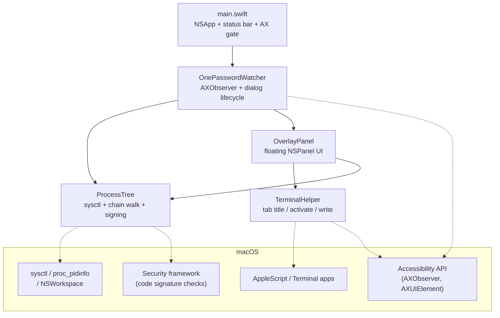
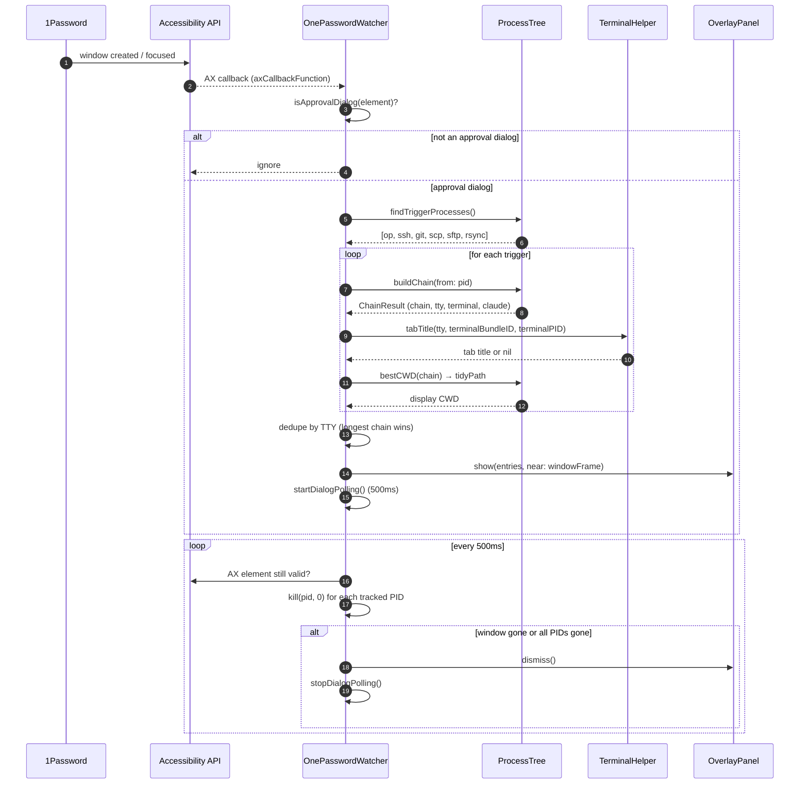
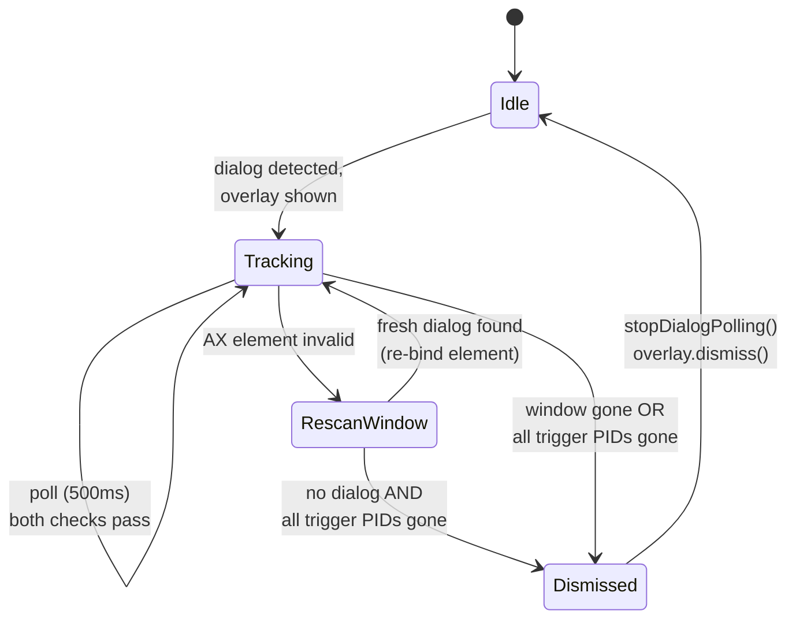
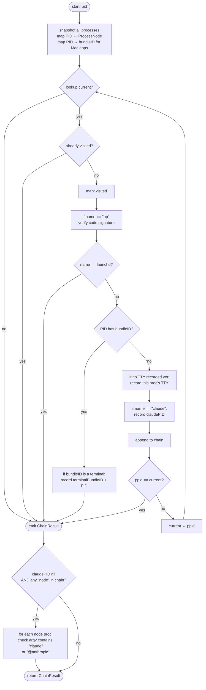

# op-who Architecture

## 1. Overview

`op-who` is a macOS menu bar utility that identifies which process triggered a 1Password approval dialog. When 1Password presents an approval prompt for the CLI (`op`) or the SSH agent integration, the dialog tells you *which application* requested access, but not *which terminal session* or *which command*. `op-who` fills in that gap by detecting the dialog, finding plausible trigger processes, walking each one's parent chain up to the terminal, and showing a floating overlay with the chain, working directory, terminal tab title, and (where applicable) Claude Code session name.

The app runs as a menu bar item (`LSUIElement=true`), holds Accessibility permission to observe 1Password's window events, and is non-sandboxed because it must enumerate other processes and read their working directories. It is distributed as a signed and notarized `.app` bundle.

## 2. High-Level Architecture

`op-who` is a small Swift Package with two targets: a library (`OpWhoLib`) that contains all logic, and a thin executable (`op-who`) that wires up `NSApplication` and the status bar item.

Module responsibilities at a glance:

- **`main.swift`** — bootstraps `NSApplication`, installs the status bar item, requests Accessibility permission, instantiates `OnePasswordWatcher`.
- **`OnePasswordWatcher`** — attaches an `AXObserver` to 1Password, classifies window events as approval dialogs, builds overlay entries, and polls for dismissal.
- **`ProcessTree`** — pure logic for process enumeration, parent-chain walking, app-boundary detection, code signature verification, CWD lookup, and Claude Code detection.
- **`OverlayPanel`** — non-activating floating `NSPanel` that renders the entries and exposes "Show Tab" / "Send Message" actions.
- **`TerminalHelper`** — terminal-app integration: tab title lookup, tab activation, TTY message writes.

## 3. Lifecycle: From Approval to Overlay

### 3.1 Sequence Diagram

The full path from a 1Password approval prompt to a dismissed overlay:

### 3.2 Detection: CLI vs SSH-Agent Dialogs

1Password renders its UI in an Electron web view. When a window first appears, the AX tree is often empty or only partially populated, so any content-based detection ("does the dialog body say *Authorize*?") is racy and unreliable.

`OnePasswordWatcher.isApprovalDialog` therefore avoids inspecting dialog contents and instead uses a coarse two-tier filter:

1. **Subrole match** — `AXSubrole == "AXDialog"` is unambiguously an approval dialog.
2. **Title-based exclusion** — for plain `AXStandardWindow` windows, exclude known non-dialog surfaces by title prefix (case-insensitive substring match): `Lock Screen`, `All Items`, `All Accounts`, `Settings`, `Watchtower`, `Developer`. Anything else — including the generic `1Password` title that both CLI and SSH approvals share — is treated as a candidate.

A candidate window only produces an overlay if `ProcessTree.findTriggerProcesses()` finds at least one running process named `op`, `ssh`, `git`, `scp`, `sftp`, or `rsync`. This is what implicitly distinguishes "real approval dialog" from "any other 1Password window I forgot to exclude" — without trigger processes there's nothing meaningful to show, and the overlay is suppressed.

This split has a consequence: there is no separate codepath for CLI vs SSH-agent approvals. Both result in the same trigger-process scan and the same overlay layout. Multiple trigger processes will produce multiple entries in a single overlay (one per session, after deduplication).

### 3.3 Dismissal

Dismissal is poll-based rather than event-based. 1Password does not consistently fire `kAXUIElementDestroyedNotification` for its dialogs (the Electron view re-renders asynchronously and can invalidate AX element references), so `OnePasswordWatcher` runs a 500 ms timer that checks two independent conditions:

The two checks:

1. **Window check** — read `kAXRoleAttribute` on the cached `AXUIElement`. If the call fails, the cached reference is stale — re-enumerate 1Password's windows and re-bind to a fresh approval-dialog element if one still exists. Only conclude the window is gone after the rescan also fails.
2. **Process check** — for every triggering PID recorded when the overlay was shown, send signal `0` via `kill(pid, 0)`. This delivers no signal but returns whether the process exists. If *all* tracked PIDs are gone, the dialog has been answered and the overlay should close.

Either condition individually causes dismissal. Tracking *all* trigger PIDs (not just the deduplicated ones shown in the overlay) prevents false dismissals when, for example, one of two `op` processes exits but the dialog is still up for the other.

## 4. Components

### 4.1 `main.swift` — bootstrap and accessibility gate

Wires up `NSApplication`, creates the `op?` status bar item with a "Quit" menu, and instantiates `OnePasswordWatcher`. Before doing anything else, it calls `AXIsProcessTrustedWithOptions` with `kAXTrustedCheckOptionPrompt: true`. If permission is missing, it shows a one-shot alert directing the user to System Settings — but does *not* block startup. The watcher will simply receive no events until the user grants permission and restarts the app. This file should stay thin; all behavior lives in `OpWhoLib`.

### 4.2 `OnePasswordWatcher` — dialog lifecycle

The longest-lived object in the app. Responsibilities:

- **Attach/detach lifecycle** — observes `NSWorkspace.didLaunchApplicationNotification` and `…didTerminateApplicationNotification` for the two known 1Password bundle IDs (`com.1password.1password`, `com.agilebits.onepassword7`). On attach, verifies the running 1Password's code signature against Apple Team ID `2BUA8C4S2C` *before* registering the AX observer — this prevents a maliciously-renamed process from receiving AX notifications.
- **AX observer registration** — creates an `AXObserver` for the 1Password PID, subscribes to `kAXWindowCreatedNotification` and `kAXFocusedWindowChangedNotification`, and adds the observer's run loop source to `CFRunLoopGetMain()` so callbacks fire on the main thread.
- **Approval-dialog classification** — `isApprovalDialog(_:)` (see §3.2).
- **Entry assembly** — for each trigger process, build a `ChainResult`, look up the terminal tab title, extract Claude session info if a Claude PID is in the chain, and find the best CWD by walking up from the trigger.
- **Deduplication** — entries that share a TTY are collapsed to the one with the longest chain. The intuition: if two `op` processes are running in the same terminal session, they descend from the same shell, and the shorter chain is a strict suffix of the longer. Entries without a TTY are kept as-is (they typically represent processes that were filtered out earlier).
- **Filter for empty contexts** — entries with `chain.count <= 1 && tty == nil` are dropped. This is how 1Password's own internal `op` helper (no parent chain, no TTY) gets excluded without hard-coding its identity.
- **Polling** — see §3.3.

The AX C callback `axCallbackFunction` (file-private, outside the class) is the trampoline from the C-API observer back into Swift. It uses `Unmanaged.passUnretained` to round-trip a `self` pointer through the `refcon` parameter. Because it's `passUnretained`, the watcher must outlive its own observer — `deinit` removes notifications before the references drop.

### 4.3 `ProcessTree` — process discovery and chain walking

A pure namespace (`enum`, no instances). All functions are static and side-effect-free, which makes the bulk of the testable surface live here.

Key responsibilities:

- **Enumeration** — `allProcesses()` calls `sysctl(KERN_PROC, KERN_PROC_ALL)`, sizes the kinfo buffer dynamically, and maps each `kinfo_proc` to a `ProcessNode` (PID, PPID, name, TTY device path, `executablePath: nil` initially).
- **Trigger discovery** — `findTriggerProcesses()` does a single scan and filters by name (`op`, `ssh`, `git`, `scp`, `sftp`, `rsync`). Code signature verification of `op` is *not* done here — it's deferred to chain-building time so initial detection isn't slowed by a Security-framework call per match.
- **Chain walking** — `buildChain(from:)` is the workhorse (see §5).
- **Code signing** — two entry points:
  - `isRunningProcessSignedByOnePassword(pid:)` uses `SecCodeCopyGuestWithAttributes` (live process) and is used to gate AX-observer attachment to 1Password itself.
  - `isSignedByOnePassword(path:)` uses `SecStaticCodeCreateWithPath` (on-disk binary) and is used to badge `op` processes in the overlay (verified = green, unverified = orange).

  Both check the same requirement: `anchor apple generic and certificate leaf[subject.OU] = "2BUA8C4S2C"`.
- **CWD lookup** — `processCWD(pid:)` calls `proc_pidinfo(PROC_PIDVNODEPATHINFO)` for a direct kernel query. This is preferred over `lsof` because some terminal multiplexers (notably some `tmux`/cmux configurations) cause `lsof` to return stale or wrong CWDs.
- **Claude Code detection** — Claude Code ships in two flavors: a Bun-based standalone binary (Homebrew install, process name `claude`) and a Node CLI (npm install, process name `node`). We support both. First check for a process literally named `claude` in the chain — this catches the Homebrew/Bun build. If none, fall back to scanning any `node` processes in the chain and asking `KERN_PROCARGS2` whether their argv contains `claude` or `@anthropic` — this catches the npm build. The session name is then resolved via `claudeSessionInfo(pid:)`, which reads the process CWD via `proc_pidinfo` and returns the basename. The Bun build does not keep session JSONL files open as long-lived file descriptors, so any approach based on scanning `lsof` output for `.claude/projects/` paths would miss them; the CWD basename is a stable proxy for both flavors.
- **Path tidying** — `tidyPath(_:)` replaces `$HOME` with `~` for display.

### 4.4 `OverlayPanel` — floating dialog UI

A non-activating `NSPanel` (`.nonactivatingPanel`, `level = .popUpMenu`, `isFloatingPanel = true`) so it appears above 1Password's modal without stealing focus. Layout is built imperatively with `NSStackView`s — no XIB or SwiftUI.

`ProcessEntry` carries everything one row needs: PID, chain, TTY, tab title, Claude session, terminal bundle ID, CWD. For each entry the panel renders:

- The chain as a single attributed string with arrows (`→`), monospaced, colored per node. `op` nodes are green if signature-verified, orange otherwise; everything else uses the default label color. Unverified `op` nodes display as `unverified op` instead of `op`.
- The CWD on a separate line with head-truncation (so the meaningful tail of long paths stays visible).
- Optional `Claude: <session>` line in blue when Claude was detected.
- Optional `Tab: <title>` line for terminal tab title.
- A `PID: … TTY: …` detail line in tertiary color.
- "Show Tab" and "Send Message" buttons, but only when a TTY is present.

The panel is positioned just above the 1Password dialog using `axWindowFrame` (with AppKit/AX coordinate-system flip), centered horizontally. If no frame is available, it falls back to slightly above screen-center.

### 4.5 `TerminalHelper` — terminal app integration

Three public operations, each branched per terminal:

| Operation | Terminal.app | iTerm2 | Ghostty / Warp / cmux |
|---|---|---|---|
| Tab title | AppleScript (`tty of t`) | AppleScript (`tty of s`) | AX API: window title containing TTY |
| Tab activation | AppleScript (`set selected tab`) | AppleScript (`select s`) | App activation only |
| Write message | `FileHandle(forWritingAtPath:)` | same | same |

All operations validate the TTY against `^/dev/ttys\d+$` before any I/O — this is the trust boundary for anything that takes a TTY path from a process listing and turns it into a syscall. Invalid TTYs are logged and rejected.

Tab title lookup for unknown terminals: enumerate AX windows for the terminal PID; prefer one whose title contains the short TTY name (e.g. `ttys003`); otherwise return the first non-empty title.

## 5. Process-Chain Walking

`ProcessTree.buildChain(from: pid_t)` is the algorithm at the heart of the app. Given a starting PID, it walks PPID links upward and assembles a `ChainResult`.

Notable properties:

- **Stops at app boundaries.** `NSWorkspace.shared.runningApplications` enumerates all GUI apps with bundle IDs. If the current PID has one, the walk stops *without* including that node — 1Password already shows the app name, so we'd be duplicating information. As a side effect we capture the terminal's bundle ID and PID for later use by `TerminalHelper`.
- **Stops at `launchd`.** Walking past PID 1 has no value.
- **Cycle-safe.** A `visited: Set<pid_t>` and a `ppid == current` self-parent check guard against degenerate cases.
- **TTY is a fold, not a filter.** We record the *first* TTY encountered while walking up. The trigger process's own TTY is preferred when present, but it isn't required — some processes (`op` invoked from a script with redirected stdio) report no TTY, and we'll happily pick up the shell's TTY a few hops up.
- **Claude detection happens twice.** Claude Code ships as either a Bun-based binary (Homebrew, process name `claude`) or a Node CLI (npm, process name `node`). A direct match for a process named `claude` happens during the walk and catches the Homebrew/Bun build. If that misses, a post-walk scan looks at the process arguments of any `node` process in the chain and catches the npm build.
- **`1 + N` `sysctl` snapshots per dialog.** `findTriggerProcesses()` does one scan, then each of the `N` `buildChain` calls does another. This is acceptable given the relative rarity of approval dialogs, and the snapshots do not need to be coherent with each other — chain walking only needs internal consistency within a single snapshot.

## 6. Key Design Decisions

These are the non-obvious decisions a new contributor is most likely to question. Each is captured as decision + rationale.

- **Stop the chain at any process that's a registered macOS app.** Rationale: 1Password's own dialog already names the app (Terminal, iTerm2, etc.). Including it in our overlay just adds noise. The `NSWorkspace.runningApplications` lookup is the cheapest reliable way to ask "is this PID a GUI app?".
- **Drop trigger processes that have no parent chain *and* no TTY.** Rationale: 1Password ships an internal `op` helper that runs as a child of the 1Password app and has no terminal. It's a trigger by name but not by intent. Filtering by "no chain *and* no TTY" excludes it without hardcoding a path or PID.
- **Detect approval dialogs by window title exclusion, not by content.** Rationale: 1Password's dialog body is rendered in an Electron web view that loads asynchronously. Content-based detection is racy. Title-based filtering combined with the trigger-process scan is robust enough in practice.
- **Detect SSH-agent approvals via co-occurring SSH client processes.** Rationale: 1Password's SSH-agent dialog looks identical to its CLI dialog at the AX level — same title, same role. The differentiator is that an `op` CLI prompt has an `op` process running, whereas an SSH-agent prompt has a `ssh`/`git`/`scp`/etc. process running alongside 1Password's internal `op` helper.
- **Detect dialog dismissal by polling (500 ms), not by AX events.** Rationale: 1Password does not reliably fire window-destroyed events for its dialogs. Polling AX-element validity *and* trigger-process liveness covers both common dismissal paths (user clicks button → window closes; trigger times out → process exits before window is reaped).
- **Walk the chain to find the first non-`/` CWD.** Rationale: the trigger process (`op`, `ssh`) is often spawned with CWD `/` by some shells or wrappers. The user actually cares about the *shell's* CWD — which is one or two hops up. Walking until a non-`/` CWD is found gives the right answer in the common case while still showing `/` honestly when that's all there is.
- **Detect Claude Code in two passes: by process name, then by `node` arguments.** Rationale: the Homebrew install ships a Bun-based standalone binary (process name `claude`) and the npm install runs as `node`. The first pass catches the Homebrew case directly; the second pass scans `KERN_PROCARGS2` of any `node` processes for `claude` or `@anthropic`. The session name comes from the process CWD basename — the Bun build no longer holds session JSONL files open, so an `lsof`-based scan for `.claude/projects/` paths would miss them, while the CWD is reliably set to the project directory by both flavors.
- **`LSUIElement = true` in `Info.plist`.** Rationale: `op-who` is a menu bar utility — there's no main window, no dock presence, no app switcher entry. The `LSUIElement` flag is what makes that work.

## 7. Threading Model

`op-who` is essentially single-threaded: nearly all work happens on the main thread.

- **AX observer callbacks.** `AXObserverGetRunLoopSource(observer)` is added to `CFRunLoopGetMain()` in `.defaultMode`, so every `axCallbackFunction` invocation runs on the main thread. No locking is needed for `OnePasswordWatcher`'s mutable state.
- **`NSWorkspace` notifications.** Posted on `.main` queue.
- **Polling timer.** `Timer.scheduledTimer` fires on the main run loop.
- **Overlay updates.** Wrapped in `DispatchQueue.main.async` defensively, even though the call sites are already on the main thread — a guard against future changes that might move work off the main thread.
- **External processes.** `Process.run()` (used for `lsof` in Claude session detection) blocks the main thread for the duration of the subprocess. This is acceptable because (a) `lsof -p <pid>` returns in tens of milliseconds for a single process, and (b) it only runs when an approval dialog has just appeared, which is already an interactive moment.
- **AppleScript.** `NSAppleScript.executeAndReturnError(_:)` blocks the main thread. Same reasoning: only runs in response to user action ("Show Tab" / `tabTitle` lookup), and is short-lived.

The single-threaded model is a deliberate choice. The work is event-driven and bursty (one approval dialog at a time) and dialog-handling latency is dominated by user reaction time, not our code. Introducing concurrency would require synchronizing `OnePasswordWatcher`'s tracked state across threads with no measurable benefit.

## 8. Testing Strategy

Tests use Swift Testing (`import Testing`) and run via `swift test`. Coverage focuses on the parts where unit tests give real signal:

- **`ProcessTree`**
  - `ProcessNode.displayName` and `chainDisplayName` formatting.
  - `formatChain` arrow-join formatting.
  - `tidyPath` HOME-substitution behavior.
  - `allProcesses` smoke test (returns a non-empty list, includes the test process itself).
  - `findOpProcesses` filtering on a live process listing.
- **`TerminalHelper`**
  - `isValidTTYPath` regex acceptance/rejection across realistic and adversarial inputs.

Deliberately *not* unit-tested:

- **AX observer wiring (`OnePasswordWatcher`)** — needs a live 1Password process and a real approval dialog. Validated manually.
- **Code signature checks** — depend on real signed binaries on the host. Validated by running against a real `op` install during release rehearsal.
- **AppleScript paths in `TerminalHelper`** — depend on Terminal.app / iTerm2 being installed and scripting permissions being granted. Validated manually per terminal.
- **Overlay layout** — visual; verified by running the app.

The library/executable split exists primarily to make this testable: `main.swift` is the only place where `NSApplication` is instantiated, and it's also the only place that's effectively untested.

## See also

- [README.md](../README.md) — user-facing overview and feature list.
- [CONTRIBUTORS.md](../CONTRIBUTORS.md) — build, test, release process.
- [docs/cert-sign-guide.md](cert-sign-guide.md) — Developer ID certificate setup for signing and notarization.
